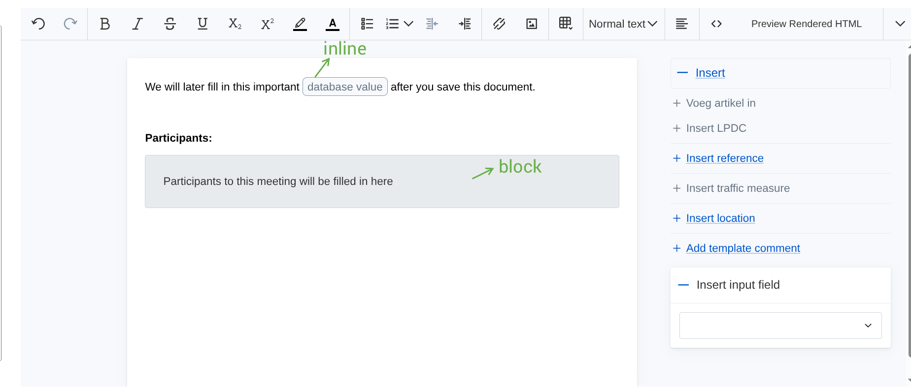

# Locked placeholders

## Setup

```ts
const editor = await renderEditor({
  plugins: [, /*...*/ "locked-placeholder"],
  options: {
    /* this plugin has no configuration options */
},
  },
```

Locked placeholders are nodes in the document which are not editable by a user. They are designed to indicate areas of the document which will later be filled in through some outside process. 
For example:

An application which manages meeting notes could have its own system of managing attendees/absentees, outside of the editor. However, since this is information that also needs to be published, the application will at some point need to generate a textual (html) rendering of that information, and somehow merge it with the document contents that were created in the editor. 
In many cases, this is done by splitting up the various parts of the document, and using an editor instance for each, like a formfield. However, other users may want to keep the document as a whole unit in the editor, and rather "fill in" the externally generated parts at some stage in the process. 

This locked-placeholder feature, along with the [headless processing interface](../headless-processing.md), are designed to facilitate this usecase.

A locked placeholder is simply a node in the document which cannot be edited. This can be used to indicate to the user that that node will later be replaced with generated content.

There are 2 different kinds of placeholder: inline and block. In the editor, they look like this:




## Creating locked placeholders

A locked placeholder on its own does nothing, as such there is currently no way a user can create one themselves. It is intended to be used by the developer, by creating a template that contains one or more of these placeholders.

This is done by including specific html tags in the template, which the editor will interpret as locked placeholders. The syntax is as follows:

### inline

```html
<span data-locked-placeholder="true" data-locked-placeholder-type="inline" data-label="database value" data-key="db_val"></span>
```

### block

```html
<div data-locked-placeholder="true" data-locked-placeholder-type="block" data-label="Participants to this meeting will be filled in here" data-key="db_participants"></div>
```


### attributes

We use html [data-attributes](https://developer.mozilla.org/en-US/docs/Web/HTML/How_to/Use_data_attributes) for all configuration. They are pretty simple:

- `data-locked-placeholder="true"`: this tells the editor this html element is intended to be a locked placeholder. Note: in order to keep the code simple, we do require the value to be the string `"true"`, simply having the attribute present is not enough.

- `data-locked-placeholder-type="block" | "inline"`: along with the element type (span or div) this tells us which type of placeholder it needs to become. This may seem a bit redundant given the element types, but "inline-ness" of html elements can be a bit of a debate, depending on css, so we keep things explicit.

- `data-label`: The label shown to the user in the editor.

- `data-key`: an arbitrary string value to easily distinguish placeholders in your processing logic. (See below)


## Processing locked placeholders

Without processing, the locked placeholders are a bit useless. This is why we provide a simple API to replace the placeholders with their intended content.
Note: this uses the API for [headless processing](../headless-processing.md), so give that a read first.

```ts
import {
  processDocumentHeadlessly,
  replaceLockedPlaceholderContent,
} from '@lblod/embeddable-say-editor';
// make sure this config is the same as the one you use for the intended interactive editor instance
import { myEditorConfig } from '../somewhere-in-my-app/editor-config.ts'


const htmlBeforeProcessing = `<div data-locked-placeholder="true" data-locked-placeholder-type="block" data-label="Block" data-key="my-key"></div>`

const values = {
  // keep in mind this HTML will be interpreted and processed by the editor, in exactly the same way it would do this if the editor was interactive. This might lead to unexpected results, so make sure to test thoroughly.
  'my-key': '<p>Generated content for block:</p><ul><li>Sample item 1</li><li>Sample item 2</li></ul>',
};

const result = processDocumentHeadlessly(
    htmlBeforeProcessing,
    (state) => replaceLockedPlaceholderContent(state, values),
    myEditorConfig,
  );

// note the extra elements and attributes which the editor adds to normalize the html and support various features
result === `<div lang="nl-BE" data-say-document="true" data-literal-node="true" data-has-non-literal-contents="false"><div class="say-hidden" data-rdfa-container="true" style="display: none;"></div><div data-content-container="true"><p class="say-paragraph">Generated content for block:</p><ul hierarchical="false" class="say-bullet-list" style=""><li class="say-list-item"><p class="say-paragraph">Sample item 1</p></li><li class="say-list-item"><p class="say-paragraph">Sample item 2</p></li></ul></div></div>`
```

So in essence, the `replaceLockedPlaceholderContent` function simply takes in an editor state (meant to come from the `processDocumentHeadlessly` context) and a map of key -> html value strings. The key being, of course, the value of the `data-key` attribute you gave the placeholder element.


